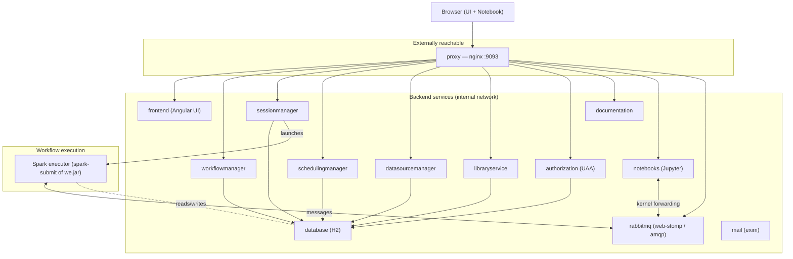

# Seahorse

Seahorse is a visual framework for creating Apache Spark data-processing workflows.
Users design pipelines in a browser-based editor; a cluster of backend services
compiles, schedules and executes them on Spark, and a Jupyter-based notebook lets
users interact with the resulting `DataFrame`s in Python, R or SQL.

This repository has been **modernized** from the original Spark 3.0.0 / Scala 2.12 /
JDK 8 baseline to a current runtime — see [Technology Stack](#technology-stack).
The ongoing modernization plan and task tracker live in [update.md](update.md);
per-task notes are in [migration/](migration/).

## Repository Details

| Product Group | Module Name | Name | Description |
|---------------|-------------|------------------|-------------|
| magik | ae | ae-seahorse-svc | Seahorse Workflow Execution Service |

---

## Architecture

Seahorse is a multi-service application. A single **proxy** (nginx) is the only
externally exposed entry point; it fronts the Angular UI and reverse-proxies every
backend service and the notebook/message bus. Services talk to each other over an
internal Docker network and share an H2 database. Workflow execution is delegated to
short-lived **Spark executor** processes that the Session Manager launches via
`spark-submit`.



### Components

| Service | Docker image | Internal port | Role |
|---|---|---|---|
| **proxy** | `seahorse-proxy` | 9093 | nginx gateway — the only externally exposed port; serves the UI and reverse-proxies all services |
| **frontend** | `seahorse-frontend` | 80 | Angular 1.5 single-page editor (built from source with webpack 2) |
| **workflowmanager** | `seahorse-workflowmanager` | 60103 | Stores/serves workflows and notebooks — `GET/POST /v1/workflows` |
| **sessionmanager** | `seahorse-sessionmanager` | 9082 | Manages execution sessions; launches Spark executors via `spark-submit` |
| **schedulingmanager** | `seahorse-schedulingmanager` | 60110 | Scheduled/recurring workflow runs |
| **datasourcemanager** | `seahorse-datasourcemanager` | 8080 | External data-source definitions (JDBC, files, …) |
| **libraryservice** | `seahorse-libraryservice` | 9083 | User file/library storage |
| **notebooks** | `seahorse-notebooks` | 8888 | Jupyter Server 2 / Notebook 7; PySpark & SparkR kernels forwarded to the executor |
| **rabbitmq** | `seahorse-rabbitmq` | 15674 / 5672 | Message bus (web-stomp for the editor, AMQP for executor↔notebook) |
| **database** | `seahorse-h2` | 1521 | Shared H2 database for the services |
| **authorization** | `seahorse-authorization` | 8080 | CloudFoundry UAA (optional; prebuilt image) |
| **documentation** | `seahorse-documentation` | 80 | Static docs (prebuilt image) |
| **mail** | `seahorse-mail` | 25 | exim SMTP (notifications) |
| *(executor)* | `seahorse-spark` | — | Base runtime for the Spark executor launched by the Session Manager (not a long-running service) |

### Two sbt builds

The backend is split into **two independent sbt builds**, each with its own
`project/Dependencies.scala` and Spark-version `match` blocks:

- **root build** — the backend services (`workflowmanager`, `sessionmanager`,
  `schedulingmanager`, `datasourcemanager`, `libraryservice`, `commons`, …).
- **`seahorse-workflow-executor/`** — the execution engine (`deeplang`, `api`,
  `workflowexecutor`, Spark compatibility shims `sparkutils<ver>`).

Any dependency or Spark-version change generally has to be made in **both** builds.

---

## Technology Stack

| Area | Version | Notes |
|---|---|---|
| Apache Spark | **3.4.4** | Hadoop 3, **Scala 2.13** distribution (`spark-3.4.4-bin-hadoop3-scala2.13`) |
| Scala | **2.13.12** | migrated from 2.12 |
| JDK | **17** (LTS) | migrated from 8; needs Spark 3.4 `--add-opens` incl. `sun.security.ssl` |
| HTTP / actor stack | **Apache Pekko 1.1.x** (pekko-http 1.1.0) | replaced Akka/Spray |
| sbt | **1.8.2** | |
| Python (executor & notebook) | **3.12** | PySpark bridge + Jupyter kernels |
| Jupyter | **Server 2 / Notebook 7** | base image `quay.io/jupyter/minimal-notebook:python-3.12` |
| Frontend | Angular 1.5 + **webpack 2** on **Node 22 / npm 10** | built from source |
| Containers | Docker + Docker Compose v2 | |

---

## Prerequisites

To **build** the project you need:

- **JDK 17** — set `JAVA_HOME` to a JDK 17 install (e.g. `export JAVA_HOME=/usr/lib/jvm/java-17-openjdk`).
- **sbt 1.8.2** (or a launcher that honors `project/build.properties`).
- **Docker 20.10+** and the **Compose v2** plugin (`docker compose`).
- **Python 3** — the `build/` orchestration helpers run under `python3`.
- **Node 22 + npm 10** — only if you build the `seahorse-frontend` image from source.
- **Several GB free disk** — an sbt build pulls multiple GB into `~/.ivy2` /
  `~/.cache/coursier`, and the images (notably `seahorse-notebooks` ~1.5 GB,
  `seahorse-spark` / `seahorse-sessionmanager` several GB) are large.

> The active `SPARK_VERSION` selects the compatibility arm. It defaults to `3.4.4`
> in [build/manage-docker.py](build/manage-docker.py); the sbt builds accept
> `-DSPARK_VERSION=3.4.4`.

---

## Repository Layout

```
.
├── project/                     # root sbt build definition (Dependencies.scala, plugins)
├── workflowmanager/             # backend service
├── sessionmanager/              # backend service (launches Spark executors)
├── schedulingmanager/           # backend service
├── datasourcemanager/           # backend service
├── libraryservice/              # backend service
├── backendcommons/              # shared backend code
├── seahorse-workflow-executor/  # SECOND sbt build: deeplang, api, workflowexecutor, spark shims
├── remote_notebook/             # Jupyter notebook image (seahorse-notebooks)
├── frontend/                    # Angular UI (seahorse-frontend)
├── deployment/                  # Dockerfiles: spark, rabbitmq, h2, exim, docker-compose generator
├── proxy/                       # nginx gateway Dockerfile
├── build/                       # build orchestration (manage-docker.py, shell wrappers)
└── update.md                    # modernization plan & task tracker
```

---

## Building

### 1. Compile / test the Scala code

```bash
export JAVA_HOME=/usr/lib/jvm/java-17-openjdk    # JDK 17

# root build (backend services)
sbt -DSPARK_VERSION=3.4.4 compile
sbt -DSPARK_VERSION=3.4.4 workflowmanager/test

# executor build
cd seahorse-workflow-executor
sbt -DSPARK_VERSION=3.4.4 compile
```

### 2. Build Docker images

All image builds go through [build/manage-docker.py](build/manage-docker.py), which
knows how to build each image the right way — a plain `docker build` for the
"simple" images (proxy, rabbitmq, h2, spark, notebooks, mail, frontend) and the
sbt-docker plugin (`<project>/docker`) for the JVM services. Every image is tagged
with the current **git HEAD sha**.

**Build a single image** (`-i` / `--images`):

```bash
# one JVM service
python3 ./build/manage-docker.py -b -i seahorse-workflowmanager

# one simple image
python3 ./build/manage-docker.py -b -i seahorse-frontend
```

**Build several images** at once:

```bash
python3 ./build/manage-docker.py -b -i seahorse-workflowmanager seahorse-sessionmanager
```

**Build everything** (`--all`):

```bash
python3 ./build/manage-docker.py -b --all
```

`--all` builds the images defined in `image_confs` in `manage-docker.py`. By
default that is the 12 locally-built images:

```
seahorse-proxy            seahorse-rabbitmq        seahorse-h2
seahorse-spark            seahorse-schedulingmanager  seahorse-sessionmanager
seahorse-workflowmanager  seahorse-datasourcemanager  seahorse-libraryservice
seahorse-notebooks        seahorse-mail            seahorse-frontend
```

`seahorse-authorization` and `seahorse-documentation` are commented out of the
`--all` set and consumed from the prebuilt `quay.io/deepsense_io/...:1.4.3`
images; re-enable them in `manage-docker.py` to build from source.

> **sbt image tip:** the sbt-docker path batches all requested JVM services into a
> single `sbt clean ... <proj>/docker` invocation. If you hit a stale
> incremental-compile error (`NoClassDefFoundError: Dependencies$`), clear the
> meta-build targets first:
> `rm -rf project/target seahorse-workflow-executor/project/target`.

---

## Deploying / Running the stack

The runnable `docker-compose.yml` is **generated** (image tags pinned to a git sha)
by [deployment/docker-compose/docker-compose.py](deployment/docker-compose/docker-compose.py):

```bash
# generate a compose file tagged with the current HEAD
GIT_SHA=$(git rev-parse HEAD)
python3 deployment/docker-compose/docker-compose.py \
  --generate-only --yaml-file docker-compose.yml -b "$GIT_SHA" -f "$GIT_SHA"

# bring the stack up
docker compose up -d

# check status / logs
docker compose ps -a
docker compose logs -f workflowmanager
```

Once up, Seahorse is reachable through the **proxy** (default port **9093**) — e.g.
`http://<host>:9093/`. The proxy serves the editor UI and routes `/v1/...` API calls,
the notebook, and the message bus.

To tear it down:

```bash
docker compose down
```

---

## Notes

- **Spark distribution must be Scala 2.13.** The default `spark-*-bin-hadoop3.tgz`
  is Scala 2.12 and will fail at runtime against the 2.13 executor
  (`NoSuchMethodError scala.util.matching.Regex.<init>`). The `seahorse-spark` image
  uses the `...-scala2.13` tarball.
- **JDK 17 module access.** The services/executor run with Spark 3.4's `--add-opens`
  set plus `--add-opens=java.base/sun.security.ssl=ALL-UNNAMED` (the executor uses an
  HTTPS client).
- **Build helper scripts are Python 3.** `build/*.py` and
  `deployment/docker-compose/docker-compose.py` target `python3`.

## Release History

See [update.md](update.md) for the full modernization tracker. Highlights:

- Spark 3.0.0 → **3.4.4**, Scala 2.12 → **2.13.12**, JDK 8 → **17**, Akka/Spray → **Pekko**.
- Python 3.7 → **3.12** (executor + PySpark), Jupyter → **Server 2 / Notebook 7**.
- Frontend now **builds from source** (webpack 1 → 2, Node 22).
- Docker image set rebuilt on the modernized stack; full `docker compose` bring-up verified.
